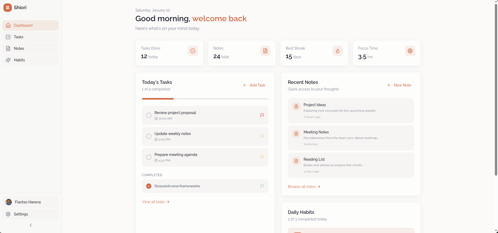

  

    <h1 style="margin: 0;">SHIORI 栞 🍃</h1>
  

❝Your calm space for focused productivity❞

  
  
  
  
  
  
  
  
  
  

> [!IMPORTANT]
> Shiori 栞 is still in development and not ready for production use.

## What is Shiori?

<strong>Shiori (栞)</strong> is a Japanese word that means <strong>"serenity"</strong> or <strong>"tranquility"</strong>.

This application aims to provide a calm space for focused productivity. It is built using modern technologies such as React, Next.js, and Tailwind CSS. The goal is to create a fast, secure, and visually pleasing application that can be used as a personal productivity tool (and to learn Next.js).

## Core Features

| Feature                             | Description                                                                                                   | Focus Area              |
| :---------------------------------- | :------------------------------------------------------------------------------------------------------------ | :---------------------- |
| **Focused Dashboard** 🧘‍♀️            | A calm, distraction-free overview showing today’s tasks, habits, and recent notes with clear visual hierarchy | Layout & UX             |
| **Minimal Navigation** 🧭           | Simple sidebar or top navigation with intuitive icons, clear labels, and smooth transitions                   | UX Flow                 |
| **Task Cards & Interactions** ✅    | Clean task cards with subtle hover states, animated checkboxes, and gentle completion feedback                | UI & Motion             |
| **Distraction-Free Notes** 📓       | Spacious writing canvas with excellent readability and progressive formatting tools                           | Typography & Layout     |
| **Habit Tracking UI** 🌱            | Soft habit cards with minimal streak indicators and calm, encouraging feedback                                | UI & Micro-interactions |
| **Consistent Typography System** ✍️ | Raleway-based type scale ensuring clarity, balance, and visual rhythm across all screens                      | Visual Design           |
| **Light & Dark Modes** 🌗           | Carefully tuned light and dark themes with equal comfort, contrast, and visual consistency                    | Theming                 |
| **Micro-Interactions & Motion** ✨  | Purposeful animations for hover, press, state changes, and list reordering using natural easing               | Motion Design           |
| **Accessible by Default** ♿        | High contrast, readable font sizes, clear focus states, and full keyboard navigation                          | Accessibility           |
| **Thoughtful Empty States** 🌸      | Friendly, calm empty states that guide users toward meaningful first actions                                  | UX Writing              |

## App Preview

**Shiori** · _Your calm space for focused productivity_ · 🍃

